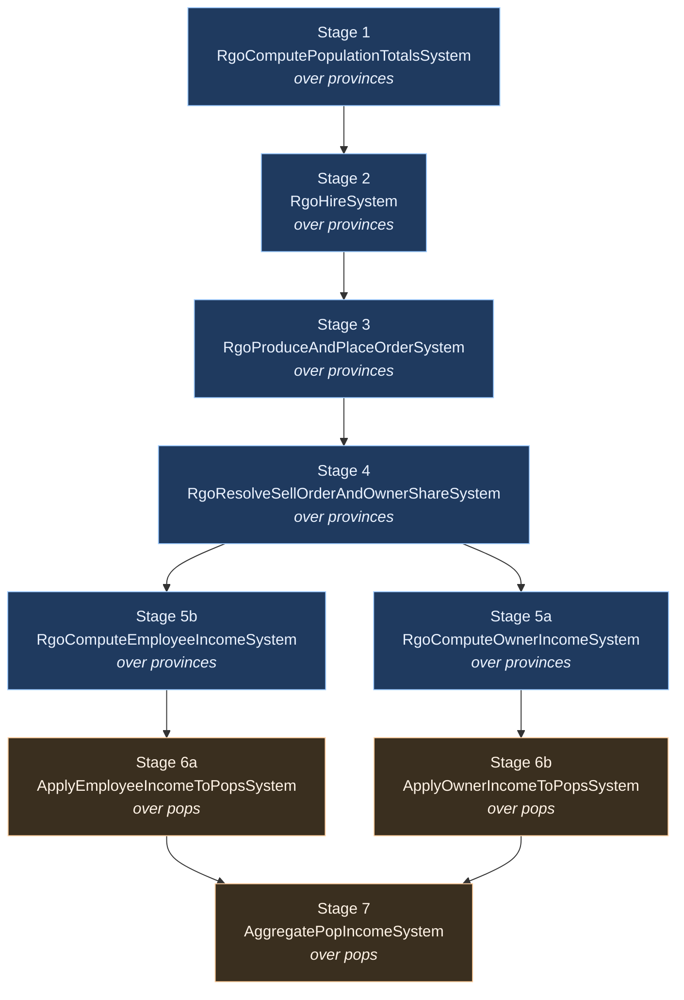

```mermaid
flowchart TD
    classDef prov fill:#1f3a5f,stroke:#9ecbff,color:#eaf2ff;
    classDef pop  fill:#3a2f1f,stroke:#ffce9e,color:#fff3e6;

    S1["Stage 1<br/>RgoComputePopulationTotalsSystem<br/><i>over provinces</i>"]:::prov
    S2["Stage 2<br/>RgoHireSystem<br/><i>over provinces</i>"]:::prov
    S3["Stage 3<br/>RgoProduceAndPlaceOrderSystem<br/><i>over provinces</i>"]:::prov
    S4["Stage 4<br/>RgoResolveSellOrderAndOwnerShareSystem<br/><i>over provinces</i>"]:::prov
    S5a["Stage 5a<br/>RgoComputeOwnerIncomeSystem<br/><i>over provinces</i>"]:::prov
    S5b["Stage 5b<br/>RgoComputeEmployeeIncomeSystem<br/><i>over provinces</i>"]:::prov
    S6a["Stage 6a<br/>ApplyEmployeeIncomeToPopsSystem<br/><i>over pops</i>"]:::pop
    S6b["Stage 6b<br/>ApplyOwnerIncomeToPopsSystem<br/><i>over pops</i>"]:::pop
    S7["Stage 7<br/>AggregatePopIncomeSystem<br/><i>over pops</i>"]:::pop

    S1 --> S2 --> S3 --> S4
    S4 --> S5a
    S4 --> S5b
    S5b --> S6a
    S5a --> S6b
    S6a --> S7
    S6b --> S7
```
