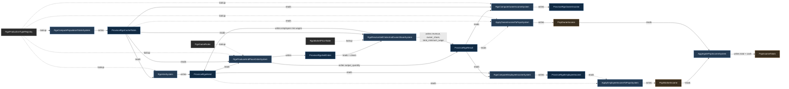

```mermaid
flowchart LR
    classDef sys  fill:#243b53,stroke:#9ecbff,color:#eaf2ff;
    classDef prov fill:#102a43,stroke:#5b8fc9,color:#d6e6ff;
    classDef pop  fill:#3a2f1f,stroke:#ffce9e,color:#fff3e6;
    classDef sing fill:#2b2b2b,stroke:#9e9e9e,color:#eee;

    %% Singletons
    REG["RgoProductionTypeRegistry"]:::sing
    PRICE["RgoMarketPriceTable"]:::sing
    RULES["RgoGameRules"]:::sing

    %% Systems
    S1["RgoComputePopulationTotalsSystem"]:::sys
    S2["RgoHireSystem"]:::sys
    S3["RgoProduceAndPlaceOrderSystem"]:::sys
    S4["RgoResolveSellOrderAndOwnerShareSystem"]:::sys
    S5a["RgoComputeOwnerIncomeSystem"]:::sys
    S5b["RgoComputeEmployeeIncomeSystem"]:::sys
    S6a["ApplyEmployeeIncomeToPopsSystem"]:::sys
    S6b["ApplyOwnerIncomeToPopsSystem"]:::sys
    S7["AggregatePopIncomeSystem"]:::sys

    %% Province components
    CACHE["ProvinceRgoCacheTotals"]:::prov
    HIRED["ProvinceRgoHired"]:::prov
    ORDER["ProvinceRgoSellOrder"]:::prov
    RESULT["ProvinceRgoResult"]:::prov
    OINC["ProvinceRgoOwnerIncome"]:::prov
    EINC["ProvinceRgoEmployeeIncome"]:::prov

    %% Pop components
    PWI["PopWorkerIncome"]:::pop
    POI["PopOwnerIncome"]:::pop
    PIT["PopIncomeTotals"]:::pop

    %% Stage 1
    REG -.->|lookup| S1
    S1 -->|writes| CACHE

    %% Stage 2
    CACHE -->|reads| S2
    REG -.->|lookup| S2
    S2 -->|writes| HIRED

    %% Stage 3
    HIRED -->|reads| S3
    CACHE -->|reads| S3
    REG -.->|lookup| S3
    RULES -.->|lookup| S3
    S3 -->|"writes output_quantity"| RESULT
    S3 -->|writes| ORDER

    %% Stage 4
    ORDER -->|reads + clears| S4
    PRICE -.->|lookup| S4
    CACHE -->|reads| S4
    S4 -->|"writes revenue, owner_share,<br/>total_minimum_wage"| RESULT
    S4 -->|"writes employee min wages"| HIRED

    %% Stage 5
    RESULT -->|reads| S5a
    CACHE -->|reads| S5a
    REG -.->|lookup| S5a
    S5a -->|writes| OINC

    RESULT -->|reads| S5b
    HIRED -->|reads| S5b
    S5b -->|writes| EINC

    %% Stage 6
    HIRED -.->|reads| S6a
    EINC -.->|reads| S6a
    S6a -->|writes| PWI

    RESULT -.->|reads| S6b
    CACHE -.->|reads| S6b
    REG -.->|lookup| S6b
    S6b -->|writes| POI

    %% Stage 7
    PWI -->|reads| S7
    POI -->|reads| S7
    S7 -->|"writes total + cash"| PIT
```
